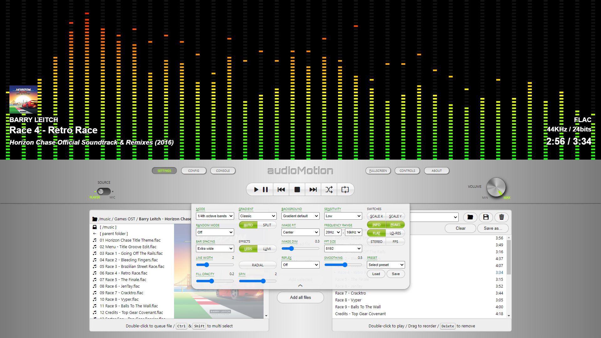
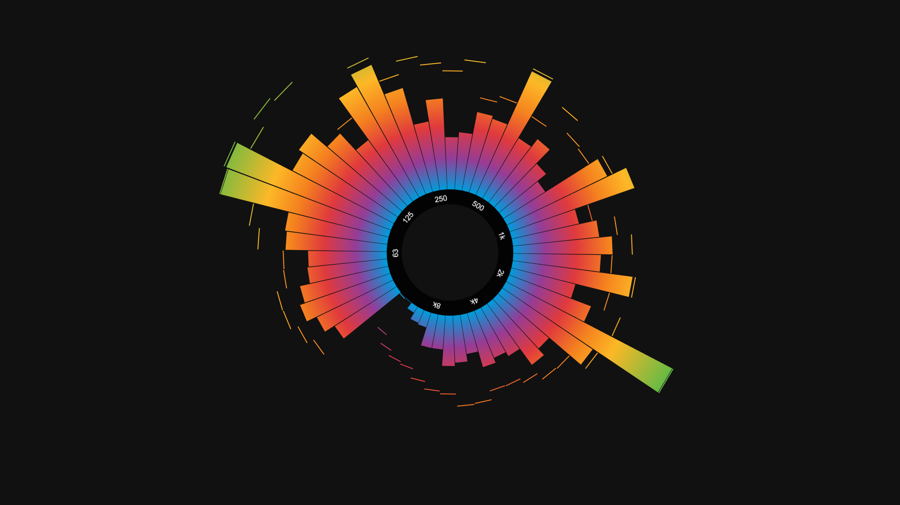

# ♪♫ **See** your music with **audioMotion**! ♪♫

[](https://github.com/hvianna/audioMotion.js/releases/latest)
[](https://github.com/hvianna/audioMotion.js/releases/latest)

**audioMotion** is a high-resolution real-time audio spectrum analyzer and full-featured music player written in JavaScript.

The spectrum analyzer module is also available as a [standalone project](https://github.com/hvianna/audioMotion-analyzer) and a zero-dependency [npm package](https://www.npmjs.com/package/audiomotion-analyzer) you can use in your own JavaScript projects!

## Features

- High-resolution real-time dual channel audio spectrum analyzer
- Fullscreen support at up to 60fps, ready for retina / HiDPI displays
- Logarithmic frequency scale with customizable range
- Visualize discrete frequencies or octave bands based on the equal tempered scale
- Optional effects: vintage LEDs, luminance bars, reflection, radial visualization
- 17 beautiful color gradients
- HTML5 audio player for MP3, AAC (m4a), OGG and FLAC files (support may vary depending on browser and operating system)
- Visual file explorer and play queue with drag-and-drop functionality
- Support for M3U playlists (`m3u` and `m3u8` file extensions)
- Visualize audio from your microphone (or "stereo mix", if your soundcard supports it)
- Lightweight custom file server — also works on standard web servers with minimal configuration
- Client runs on any modern browser (tested on Chrome, Firefox, Opera and Safari)

## Live demo

[▶ **TRY THE LIVE DEMO**](https://audiomotion.me/public/)

The demo allows you to play audio files from your PC, remote files and streams via URL and use the microphone input.
The file explorer is not available, since there are no media files hosted on the demo server.

Also check out our [▶ **YouTube channel**](https://channel.audiomotion.io) for some cool songs visualized with audioMotion!

## Getting started

Download the latest version from the [**releases page**](https://github.com/hvianna/audioMotion.js/releases/latest). Portable binaries are available for Windows, Linux and macOS.

Launch audioMotion and you'll be asked for the path to your music folder. Only files under that folder will be accessible to the player.

You can also use the command line argument `-m` to set the music folder when launching audioMotion:

```
audioMotion -m c:\users\john\music
```

This will start the server and should also launch the client in your browser.

The complete command line options are:

```
-m <path> : path to music directory
-p <port> : change server listening port (default is 8000)
-s        : start server only (do not launch client)
-e        : allow external connections (by default, only localhost)
```

⚠ **WARNING:**<br>
Please be aware that the `-e` flag will expose the contents of the mounted folder to anyone in your network (and potentially to the entire internet!) &mdash; use it only if you're in a trusted network and behind a firewall!

## Screenshots


_[Discrete frequencies](docs/README.md#mode) mode. User interface: [main function buttons](docs/README.md#main-function-buttons), [audio source](docs/README.md#audio-source) selector, [player controls](docs/README.md#player-controls), [volume control](docs/README.md#volume-control) and [file explorer](docs/README.md#file-explorer-and-play-queue)._

---


_1/4th-octave bands with LED effect, extra wide [bar spacing](docs/README.md#bar-spacing) and on-screen song information. User interface shows the [settings panel](docs/README.md#settings-panel) open._

---


_Fullscreen view: 1/6th-octave bands, regular bar spacing, "Outrun" gradient, [Reflex](docs/README.md#reflex) effect and complete on-screen information._

---


_Fullscreen view: [Stereo](docs/README.md#switches) Line graph, frequency and level scales on, "Rainbow" gradient._

---


_Fullscreen view: 1/8th-octave bands, [LUMI effect](docs/README.md#effects) on, "Tie Dye" gradient._

---


_Fullscreen view: 1/6th-octave bands, [Radial](docs/README.md#radial) analyzer, frequency scale on, "Apple ][" gradient._

## Documentation

For complete documentation, see the [docs](docs/README.md) folder.

## Credits and acknowledgments

**audioMotion** was largely inspired by [Soniq Viewer for iOS](https://itunes.apple.com/us/app/soniq-viewer/id448343005), by Yuji Koike.

The documentation website is powered by [GitHub Pages](https://pages.github.com/), [docsify](https://docsify.js.org/) and [docsify-themeable](https://jhildenbiddle.github.io/docsify-themeable).

### JavaScript libraries

Some of audioMotion's great features are provided by these awesome open-source libraries:

- [express](https://www.npmjs.com/package/express) - fast, unopinionated, minimalist web framework for node
- [music-metadata-browser](https://www.npmjs.com/package/music-metadata-browser) - stream and file based music metadata parser for the browser
- [notie](https://www.npmjs.com/package/notie) - clean and simple notification, input, and selection suite for javascript, with no dependencies
- [open](https://www.npmjs.com/package/open) - open stuff like URLs, files, executables
- [pkg](https://www.npmjs.com/package/pkg) - single-command Node.js binary compiler
- [readline-sync](https://www.npmjs.com/package/readline-sync) - synchronous Readline for interactively requesting user input via console
- [scrollIntoViewIfNeeded 4 everyone](https://gist.github.com/hsablonniere/2581101) - polyfill for non-standard scrollIntoViewIfNeeded() method
- [sortablejs](https://www.npmjs.com/package/sortablejs) - JavaScript library for reorderable drag-and-drop lists
- [webpack](https://www.npmjs.com/package/webpack) - JavaScript module bundler for the browser
  - [mini-css-extract-plugin](https://www.npmjs.com/package/mini-css-extract-plugin) - extracts CSS into separate files
  - [optimize-css-assets-webpack-plugin](https://www.npmjs.com/package/optimize-css-assets-webpack-plugin) - a webpack plugin to optimize / minimize CSS assets
  - [terser-webpack-plugin](https://www.npmjs.com/package/terser-webpack-plugin) - JavaScript compressor

### Graphic resources

- The font used in audioMotion's logo is [Orbitron](https://fonts.google.com/specimen/Orbitron) by Matt McInerney
- Icons provided by [icons8](https://icons8.com) licensed under [Creative Commons Attribution-NoDerivs 3.0 Unported](https://creativecommons.org/licenses/by-nd/3.0/)
- [Mouse scroll icon](https://thenounproject.com/term/mouse-scroll/628146/) by Viktor Ostrovsky, licensed under [Creative Commons CCBY](https://creativecommons.org/licenses/by/3.0/us/legalcode)
- Gradients [_Candy_](https://gradienthunt.com/gradient/172), [_Miami_](https://gradienthunt.com/gradient/950), [_Outrun_](https://gradienthunt.com/gradient/317) and [_Tie Dye_](https://gradienthunt.com/gradient/969) from [Gradient Hunt](https://gradienthunt.com)
- Gradients _Pacific Dream_, _Shahabi_, _Summer_ and _Sunset_ from [uiGradients](https://uigradients.com)
- The _Apple ][_ gradient was created based on [this post](https://creativemarket.com/blog/6-famous-logos-with-great-color-schemes) by Creative Market
- Gradients used in the UI buttons are from [ColorZilla's Ultimate CSS Gradient Generator](http://www.colorzilla.com/gradient-editor/)
- [CSS3 inset text shadow](https://codepen.io/adambundy/pen/HtmaK) by Adam Bundy
- [CSS slider switches](https://codepen.io/billyysea/pen/CHmiE) by Billy
- Radial brushed metal texture taken from [this pen](https://codepen.io/GreenSock/pen/gnoDc) by GreenSock
- Volume knob design based on [Dark dial](https://codepen.io/stormwarning/pen/yNGeMm) by Jeff

### References

These online references were invaluable for the development and improvement of audioMotion:

- [HTML Canvas Reference @W3Schools](https://www.w3schools.com/tags/ref_canvas.asp)
- [Web Audio API documentation @MDN](https://developer.mozilla.org/en-US/docs/Web/API/Web_Audio_API)
- [Web Audio API Specification](https://webaudio.github.io/web-audio-api/)
- [What does the FFT data in the Web Audio API correspond to?](https://stackoverflow.com/a/14789992/2370385)
- [HTML5 check if audio is playing?](https://stackoverflow.com/a/46117824/2370385)
- [Unlocking Web Audio — the smarter way](https://hackernoon.com/unlocking-web-audio-the-smarter-way-8858218c0e09)
- [Equations for equal-tempered scale frequencies](http://pages.mtu.edu/~suits/NoteFreqCalcs.html)
- Pure CSS modal windows based on [this pen](https://codepen.io/timothylong/pen/HhAer) by Timothy Long and [CSS Modal](https://drublic.github.io/css-modal/) by Hans Christian Reinl

## License

audioMotion.js copyright (c) 2018-2020 Henrique Avila Vianna<br>
Licensed under the [GNU Affero General Public License, version 3 or later](https://www.gnu.org/licenses/agpl.html).
